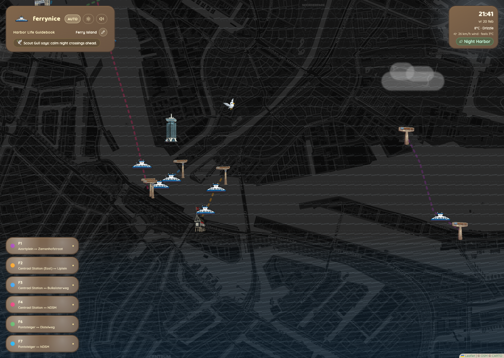

# Amsterdam Ferry Finder

Fun side project to explore Amsterdam ferries on an interactive map with route and departure details.

Live: https://ferry.bramrolvink.nl



## Stack

- React + TypeScript + Vite
- Tailwind CSS + shadcn/ui
- Leaflet (map)

## Run locally

```sh
npm install
npm run dev
```

## Production build

```sh
npm run build
npm run preview
```

## Ferry schedule updates

Schedule data lives in `src/data/ferryScheduleData.ts`.

To refresh from an external source:

```sh
npm run update:ferry-schedules
```

Environment variables used by the updater:

- `FERRY_SCHEDULE_SOURCE_URL` (required)
- `FERRY_SCHEDULE_SOURCE_TOKEN` (optional bearer token)
- `FERRY_SCHEDULE_REFRESH_CADENCE` (`weekly` or `daily`, optional)

GitHub Actions workflow: `.github/workflows/ferry-schedule-refresh.yml` (weekly by default).

## Docker

This repo includes a production-ready `Dockerfile` + `nginx.conf` for serving the built SPA.
